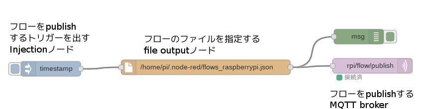
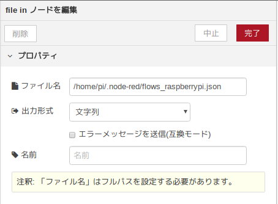

# 動作概要
MQTT Brokerにpublishされたflowを受け取り、本ソフトウエアが実行されているシステムで動作しているNode-REDのフローにするためのプログラムです。リモートでプログラムを書き換えるシステムを簡単に構築できます。また、同じソフトウエアのゲートウェイを複数台動かしている場合、すべてのプログラムを一斉に更新することができるので便利です。


# 使用するための条件
1. 管理者権限で実行するときにパスワードが必要だと正しく実行することができません。
2. node-redのdaemon起動スクリプトが必要です。Raspberry Piの場合は予めスクリプトがインストールされており、以下のコマンドで起動することができます。以下のコマンドを入力してもnode-redの起動ができない場合は、本パッケージに含まれている"nodered.service"を使用してください。
```
sudo systemctl start nodered
```

# ファイルの説明
| ファイル名 | 用途 |
|----------------|--------------|
| main-sub.rb | MQTT brokerからNode-REDのフローを受信してNode-REDに反映するメインのプログラムです。
| node-red-flow-ctrl.service | main-sub.rbを起動するdaemonスクリプトです。 |
| setting.json | main-sub.rbのパラメータ用ファイルです |
| nodered.service | node-redのdaemon起動スクリプトです。|

# setting.jsonのパラメータの確認
setting.jsonの内容を使用する内容に変更してください。

```
{
	"backup": false,
	"mqtt" : {
		"topic": "flow/publish",
		"connection": {
			"host": "AAAAAAAAAAA.iot.ap-northeast-1.amazonaws.com",
			"port": 8883,
			"ssl": true,
			"cert_file": "cert.pem",
			"key_file": "private.key",
			"ca_file": "root-CA.crt"
		}
	},
	"node-red": {
		"flows" : "/home/pi/.node-red/flows_raspberrypi.json",
		"start" : "sudo systemctl start nodered",
		"stop" : "sudo systemctl stop nodered",
		"interval": 1
	}
}
```
## パラメータ
| パラメータ| 用途 |
|---|---|
| backup | フローのバックアップの有無を指定してください。 |
| mqtt | MQTTのパラメータです。 |
| mqtt.topic | subscribするMQTTのtopicを指定してください。 |
| mqtt.connection | rubyのMQTTに渡すパラメータです。|
| node.red | node-redを制御するためのパラメータです。 |
| node-red.flows | node-redのフローファイルを指定してください。|
| node-red.start | node-redを起動するためのスクリプトを指定してください。 |
| node-red.stop | node-redを停止するためのスクリプトを指定してください。 |
| node-red.interval | node-redを起動する前のインターバルです。 |

## 実行方法
初めて実行する場合、rubyのMQTTをインストールしてください。
```
sudo gem install mqtt
```
実行方法
```
ruby main-sub.rb
```

## daemon起動の方法
### daemon起動用スクリプトのインストール
```
copy node-red-flow-ctrl.service /etc/systemd/system/
```

## 起動方法や停止方法
```
sudo systemctl start node-red-flow-ctrl
sudo systemctl stop node-red-flow-ctrl
sudo systemctl status node-red-flow-ctrl
```

### オートスタートの方法
```
sudo systemctl enable node-red-flow-ctrl
```

## nodered.serviceについて
nodered.serviceの内容を確認してください。
WorkingDirectory, ExecStart, Userなどのパラメータが正しくないと正しく動作しません。

```
[Service]
Environment="NODE_OPTIONS=--max-old-space-size=128"
Environment="NODE_RED_OPTIONS=-v"
ExecStartPre=/bin/sleep 5
ExecStart=/usr/bin/node-red
WorkingDirectory=/home/pi/.node-red/
User=pi
Group=root
Nice=10
SyslogIdentifier=Node-RED
StandardOutput=syslog
Restart=on-failure
KillSignal=SIGINT

[Install]
WantedBy=multi-user.target
```

## ローカルのフローをpublishする方法
以下のようにシンプルなフローを作成すればMQTT brokerにフローをpublishすることができます。


file inノードはこのように設定を行ってください。
injectionでトリガーが発生すると、ファイルの内容をtextで出力し、それをMQTT brokerにpublishします。


## スクリプトとフローをpublishする場合
このようにbatchとflowsというkeyのJSON形式でpublishすると、flosのフローをnode-redに適用しつつ、batchを実行してnode-redを再起動します。これでnodeの変更・追加なども行うことができます。

```
{
    "batch": "cd ~\ncd .node-red\nls\n",
		"flows"	: node-redのフロー
}
```
